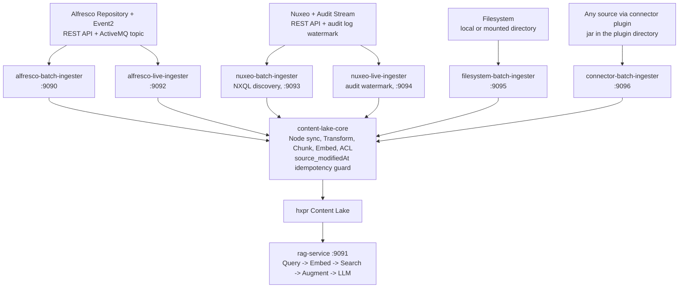

# Content Lake App

[](LICENSE)
[](https://openjdk.org/projects/jdk/25/)
[](https://spring.io/projects/spring-boot)
[](https://maven.apache.org/)
[](https://docs.docker.com/compose/)
[]()

**AI-powered semantic search and RAG over Alfresco and Nuxeo content using hxpr**

[Features](#features) | [Quick Start](#quick-start) | [Architecture](#architecture) | [Authentication](#authentication) | [API Usage](#api-usage) | [Configuration](#configuration)

## Content Lake Ecosystem

Part of the **Content Lake** ecosystem -- a PoC for ingesting Alfresco and Nuxeo content into the [ai-ready-index](https://github.com/Hyland/ai-ready-index) engine for hybrid semantic search and RAG.

| Repo | Role |
|---|---|
| **[content-lake-app](https://github.com/aborroy/content-lake-app)** | Java ingestion pipeline and RAG service (this repo) |
| [content-lake-app-deployment](https://github.com/aborroy/content-lake-app-deployment) | Docker Compose stack that wires everything together -- **start here to run the full stack** |
| [alfresco-content-lake-ui](https://github.com/aborroy/alfresco-content-lake-ui) | ACA/ADW extension: semantic search + RAG chat sidebar |
| [content-lake-app-ui](https://github.com/aborroy/content-lake-app-ui) | Standalone demo UI (Alfresco + Nuxeo dual auth) |
| [nuxeo-deployment](https://github.com/aborroy/nuxeo-deployment) | Local Nuxeo + PostgreSQL stack (required for Nuxeo profiles) |

## Documentation

| Doc | Contents |
|---|---|
| [docs/architecture.md](docs/architecture.md) | Module layout, adding a module, SPI interfaces, dependency graph, data model, design decisions |
| [docs/api.md](docs/api.md) | Every REST endpoint with request and response examples: batch ingester, RAG service, health checks, live ingester |
| [docs/configuration.md](docs/configuration.md) | Every setting: connector plugins, the CMIS connector, ingestion, live ingestion, RAG |
| [docs/security-model.md](docs/security-model.md) | Where read permissions are enforced, what the model does not do, rejected alternatives, deployment hardening checklist |
| [docs/sync-pipeline.md](docs/sync-pipeline.md) | Full/live sync flows, metadata-only path, path structure, idempotency, scope resolution |
| [plugins/README.md](plugins/README.md) | Connectors shipped as jars, the archetype, and why they sit outside the reactor |

## Overview

Proof of Concept for AI-powered semantic search and Retrieval-Augmented Generation (RAG) over Alfresco and Nuxeo content.

Leverages **hxpr** as a Content Lake to enable high-quality AI search while:

* Keeping Alfresco and Nuxeo as the sources of truth
* Enforcing server-side permissions via ACLs
* Supporting on-premises AI execution
* Minimizing data duplication

## Features

- Two-Phase Sync Pipeline: Fast metadata ingestion + async content processing
- Near Real-Time Sync: Alfresco Event2 listener over ActiveMQ using the Alfresco Java SDK
- Semantic Search: Vector embeddings with permission-aware kNN search
- RAG: LLM-powered question answering grounded in Alfresco document content
- Permission-Aware: Server-side ACL enforcement via hxpr
- Local AI: On-premises LLM and embedding models using Spring AI
- Repository Scope Model: `cl:indexed` and `cl:excludeFromLake` for Alfresco-native scope control
- REST API: Generic connector using Alfresco REST APIs
- Secured Endpoints: Alfresco authentication (username/password or tickets)
- Shared Ingestion Core: Common metadata, transform, chunking, embedding, ACL, and delete/update logic in `content-lake-core`
- Idempotent Coexistence: `alfresco_modifiedAt` guard prevents stale batch/live writes from overwriting newer content

## Architecture



### Modules

| Module | Group | Port | Description |
|--------|-------|------|-------------|
| `content-lake-repo-model` | `common/` | -- | Alfresco repository JAR that bootstraps the `cl:indexed` content model for scope control |
| `content-lake-spi` | `common/` | -- | Source Provider Interface: `SourceNode`, `ContentSourceClient`, `TextExtractor` (with `ExtractedText` / `TextFormat`), `ScopeResolver`, and the OIS-aligned `SecurityConfig` / `PermissionRule` |
| `content-lake-core` | `common/` | -- | Shared ingestion pipeline: metadata sync, transform, chunking, embedding, ACL updates, idempotency; includes source-agnostic extractors (Apache Tika, and a transform-engine client that speaks the `alfresco-transform-core` protocol for any source) composed with an ordered fallback chain |
| `rag-service` | `common/` | 9091 | Semantic search, hybrid search, RAG question answering, operational status (`/api/status`), an MCP server, agentic tool-calling, structured output, prompt-injection defense, and rate limiting |
| `content-lake-source-alfresco` | `alfresco/` | -- | Alfresco REST clients, scope resolver, and ACL expansion |
| `alfresco-batch-ingester` | `alfresco/` | 9090 | Alfresco folder discovery, batch scheduling, and `/api/sync/*` controllers |
| `alfresco-live-ingester` | `alfresco/` | 9092 | Alfresco Event2 listener over ActiveMQ using Alfresco Java SDK handlers |
| `content-lake-source-nuxeo` | `nuxeo/` | -- | Nuxeo REST clients, scope resolver, auth abstraction, and text extraction |
| `nuxeo-batch-ingester` | `nuxeo/` | 9093 | Nuxeo full-batch discovery and one-shot sync using NXQL |
| `nuxeo-live-ingester` | `nuxeo/` | 9094 | Nuxeo audit-stream listener using a persisted watermark |
| `content-lake-source-filesystem` | `filesystem/` | -- | Filesystem source: local/mounted directory client, scope resolver (glob/extension filters); uses the Tika extractor |
| `filesystem-batch-ingester` | `filesystem/` | 9095 | Filesystem directory discovery and one-shot sync via `/api/sync/configured` |
| `connector-batch-ingester` | `connector/` | 9096 | Batch discovery and one-shot sync driven by a connector plugin: no source adapter, its client comes from the plugin directory |

Thirteen modules in five groups, all built by `mvn clean package` at the root.

### Plugins

`plugins/` holds what the reactor does **not** build: connectors shipped as jars and the tooling that
makes them. Each builds on its own, and none may be added to the root POM's `<modules>` list. See
[plugins/README.md](plugins/README.md).

| Project | Path | Description |
|---------|------|-------------|
| `content-lake-connector-archetype` | `plugins/archetype/` | Maven archetype generating a connector skeleton |
| `cmis-connector` | `plugins/cmis-connector/` | Shipped connector: any CMIS 1.1 repository as a source, with OpenCMIS shaded in |
| `sample-directory-connector` | `plugins/examples/sample-directory-connector/` | Worked example: ingests a mounted directory. Not a supported source |

Do not confuse `plugins/` with the reactor group `connector/`, which holds the host application that
loads them at runtime.

## Quick Start

### Prerequisites

- Java 25+ and Maven 3.9+
- Docker and Docker Compose
- Alfresco Content Services 25.x+
  - Alfresco Transform Service (for text extraction)
- hxpr Content Lake (with OAuth2 IDP)
- Docker Model Runner (for embeddings and LLM)

### Installation

```bash
# Clone repository
git clone https://github.com/aborroy/content-lake-app.git
cd content-lake-app

# Build all modules
mvn clean package

# Deploy the repository content model to ACS before starting the ingesters
# Artifact:
#   common/content-lake-repo-model/target/content-lake-repo-model-1.0.0-SNAPSHOT.jar
# Deploy it to the Alfresco Repository classpath.

# Configure (see Environment Variables below)
export ALFRESCO_URL=http://localhost:8080
export ALFRESCO_INTERNAL_USERNAME=admin
export ALFRESCO_INTERNAL_PASSWORD=admin
# ... (see full configuration below)

# Run batch ingestion
java -jar alfresco/alfresco-batch-ingester/target/alfresco-batch-ingester-1.0.0-SNAPSHOT.jar

# Run live ingestion
java -jar alfresco/alfresco-live-ingester/target/alfresco-live-ingester-1.0.0-SNAPSHOT.jar

# Run RAG service
java -jar common/rag-service/target/rag-service-1.0.0-SNAPSHOT.jar

# Or with Docker Compose (full stack)
cd ../content-lake-app-deployment && docker compose up --build
```

### Alfresco Repo Model

The batch and live ingesters now rely on an Alfresco content model for scope control:

- `cl:indexed` marks a folder subtree as in scope for Content Lake ingestion
- `cl:excludeFromLake` lets a file opt out, or a folder subtree opt out, even when an ancestor folder is indexed

Build artifact:

```bash
common/content-lake-repo-model/target/content-lake-repo-model-1.0.0-SNAPSHOT.jar
```

Deploy that JAR to the Alfresco Repository classpath before enabling ingestion. Typical options are:

- include it in an ACS SDK `modules/platform` build
- copy or mount it into an Alfresco Repository image under `webapps/alfresco/WEB-INF/lib`

### Starting From A Non-Indexed Repository

If your Alfresco Repository does not yet use `cl:indexed`, the recommended startup sequence is:

1. Build the project and deploy the repository model JAR to Alfresco Repository.
   After deployment, restart the repository so `cl:indexed` and `cl:excludeFromLake` are available.
2. Start `batch-ingester`.
3. Run a batch synchronization against the folder you want to onboard.
   The ingester automatically adds `cl:indexed` to each root folder if it is not already present, then performs the initial backfill into Content Lake.
4. Start `live-ingester`.
   Live ingestion then keeps that indexed subtree up to date.

Example for indexing all sites under `Company Home/Sites`:

1. Resolve the Alfresco node id for `Company Home/Sites`.
   You can obtain it from Alfresco UI tools or the Alfresco REST API.
2. Run the batch sync against that folder:

```bash
curl -X POST http://localhost:9090/api/sync/batch \
  -u admin:admin \
  -H "Content-Type: application/json" \
  -d '{"folders":["SITES_FOLDER_NODE_ID"],"recursive":true,"types":["cm:content"]}'
```

This single call marks `SITES_FOLDER_NODE_ID` with `cl:indexed` (if needed) and ingests all existing content beneath it.

3. After the batch completes, start `live-ingester` so new or changed content under `Company Home/Sites` continues to sync automatically.

Important:

- `cl:indexed` can also be set directly via the Alfresco Repository nodes API or the Content Lake UI extension; the batch ingester sets it automatically only for root folders passed in the request
- `cl:excludeFromLake` on a folder removes that folder's full subtree from Content Lake scope; batch discovery skips it and live reconciliation deletes previously ingested descendants
- if you later want to index only one site, pass that site folder to `/api/sync/batch` instead of `Company Home/Sites`

### Environment Variables

```bash
# Alfresco (Internal Service Account)
export ALFRESCO_URL=http://localhost:8080
export ALFRESCO_INTERNAL_USERNAME=admin
export ALFRESCO_INTERNAL_PASSWORD=admin

# ai-ready-index engine (HTTP Basic auth)
export HXPR_URL=http://localhost:8080
export HXPR_REPOSITORY_ID=default
export HXPR_USERNAME=admin
export HXPR_PASSWORD=password

# Transform Service (batch-ingester only)
export TRANSFORM_URL=http://localhost:10090
export TRANSFORM_ENABLED=true

# ActiveMQ / Event2 (live-ingester only)
export ACTIVEMQ_URL=tcp://localhost:61616
export ACTIVEMQ_USER=admin
export ACTIVEMQ_PASSWORD=admin
export ALFRESCO_EVENT_TOPIC=alfresco.repo.event2

# Nuxeo (Nuxeo ingesters + rag-service authority lookup)
export NUXEO_URL=http://localhost:8081/nuxeo
export NUXEO_USERNAME=Administrator
export NUXEO_PASSWORD=Administrator
export NUXEO_SOURCE_ID=local

# AI/Embeddings (both services)
# Spring AI appends /v1 itself; use the Docker Model Runner root URL.
export MODEL_RUNNER_URL=http://localhost:12434
export EMBEDDING_MODEL=ai/mxbai-embed-large

# LLM (rag-service only)
export LLM_MODEL=ai/gpt-oss
export LLM_TEMPERATURE=0.3
export LLM_MAX_TOKENS=2048

# RAG defaults (rag-service only)
export RAG_DEFAULT_TOP_K=15
export RAG_DEFAULT_MIN_SCORE=0.01
export RAG_MAX_CONTEXT_LENGTH=20000
# Optional retrieval/generation features are off by default; see the Configuration
# section for the full set of RAG_* / SEARCH_HYBRID_* feature flags.

# Performance (batch-ingester only)
export TRANSFORM_WORKERS=4
export EMBEDDING_CHUNK_SIZE=900
export EMBEDDING_CHUNK_OVERLAP=120
```

## Nuxeo Backfill And Live Sync

The Nuxeo stack is deployed from the
[content-lake-app-deployment](https://github.com/aborroy/content-lake-app-deployment) companion
project, which owns every compose file for this project. It starts both the `nuxeo-batch-ingester`
and the `nuxeo-live-ingester`, and brings up the Nuxeo server and its database from
[nuxeo-deployment](https://github.com/aborroy/nuxeo-deployment) automatically.

```bash
cd ../content-lake-app-deployment
make up-nuxeo
```

To build the ingesters from your local checkout of this repository rather than from GitHub, override
the build context:

```bash
CONTENT_LAKE_GIT_CONTEXT=../content-lake-app make up-nuxeo
```

Nuxeo is available at `http://localhost:8081/nuxeo` once healthy. The stack starts:

- `nuxeo-batch-ingester` on `http://localhost:9093` for one-shot backfills
- `nuxeo-live-ingester` on `http://localhost:9094` for audit-driven incremental sync

Defaults:

- Nuxeo credentials: `Administrator` / `Administrator`
- Discovery mode: `NXQL`
- Included roots: `/default-domain/workspaces`
- Included types: `File`, `Note`

Trigger a full configured backfill:

```bash
curl -X POST http://localhost:9093/api/sync/configured \
  -u Administrator:Administrator
```

Trigger a custom backfill with request overrides:

```bash
curl -X POST http://localhost:9093/api/sync/batch \
  -u Administrator:Administrator \
  -H "Content-Type: application/json" \
  -d '{
    "includedRoots": ["/default-domain/workspaces"],
    "includedDocumentTypes": ["File", "Note"],
    "excludedLifecycleStates": ["deleted"],
    "pageSize": 50,
    "discoveryMode": "NXQL"
  }'
```

Check status:

```bash
curl http://localhost:9093/api/sync/status -u Administrator:Administrator
curl http://localhost:9093/api/sync/status/{jobId} -u Administrator:Administrator
```

The live listener has no manual sync API. Use the actuator endpoints for
health and metrics. `health` and `info` are public so the container orchestrator can probe them;
`metrics` needs the configured Nuxeo service credentials, like every other path:

```bash
curl http://localhost:9094/actuator/health
curl http://localhost:9094/actuator/metrics -u Administrator:Administrator
```

When using the deployment repo's reverse proxy, the public sync API remains `/api/sync/*`.
Route to Nuxeo by adding `?sourceType=nuxeo`; omit it or use `alfresco` for the existing Alfresco ingester.

## Authentication

REST API authentication is source-specific:

- Alfresco ingesters validate incoming credentials or tickets against Alfresco.
- `nuxeo-batch-ingester` uses HTTP Basic auth with the configured Nuxeo service credentials.
- `nuxeo-live-ingester` does not expose sync APIs; health and metrics come from Spring Actuator.
- `filesystem-batch-ingester` has no source repository to authenticate against, so it uses one
  configured account (`filesystem.batch.security.username` / `.password`, from
  `FILESYSTEM_SYNC_USERNAME` / `FILESYSTEM_SYNC_PASSWORD`). Both are required: startup fails when
  either is blank rather than falling back to a default credential on an endpoint that triggers a
  full re-ingest.

Every service denies by default. `/actuator/health` and `/actuator/info` are public so a container
orchestrator can probe them without credentials; every other path, including unmapped ones and
`/actuator/metrics`, returns 401 without authentication. Adding a controller therefore needs no
security change to protect it.

### Supported Methods

| Method | Example |
|--------|---------|
| **Basic Auth** | `curl -u admin:password http://localhost:9090/api/sync/status` |
| **Ticket (query)** | `curl "http://localhost:9090/api/sync/status?alf_ticket=TICKET_xxx"` |
| **Ticket (header)** | `curl -H "Authorization: Basic BASE64(TICKET_xxx:)" ...` |

The trailing colon in the ticket header is required: the ticket is the username of a Basic header and
the password is empty. Every service reads it the same way, through `AlfrescoTicketHeader` in
`content-lake-core`, and the bare `BASE64(TICKET_xxx)` form is rejected with 401.

**Note:** Bearer token authentication (OAuth2/OIDC with Keycloak) is not yet supported.

### Source-Native ACL Filtering

Read permissions are enforced by `rag-service`, not by the index, and the index port must never be
reachable by end users or agents. [docs/security-model.md](docs/security-model.md) explains why, what
the model does not do, and how to harden a deployment.

Current mixed-source filtering keeps Alfresco and Nuxeo principals source-native:

- Ingested ACLs are written to hxpr with the source instance suffix `_#_<sourceId>`.
- The read-time `sys_racl` predicate and the ingest-time ACEs are both produced by
  `AclFilterBuilder` in `content-lake-core`, so the two sides of the encoding cannot drift apart.
  Read access to every document depends on the predicate that class emits, so it is the one place to
  audit and it is covered by its own specification tests.
- Alfresco and Nuxeo principals are not normalized to a shared identity yet.
- `rag-service` expands Alfresco groups from Alfresco and Nuxeo groups from Nuxeo, then applies them only to matching source IDs.
- Alfresco repository admins can read an Alfresco source without a `sys_racl` condition, which gives
  repository-admin discoverability without storing synthetic `admin` ACEs in `sys_acl`. It is off
  unless `rag.security.admin-bypass.enabled` (`RAG_SECURITY_ADMIN_BYPASS_ENABLED`) is set: by default
  an administrator is ACL-filtered like every other caller. Even when enabled it applies only to
  `GROUP_ALFRESCO_ADMINISTRATORS` on an Alfresco source, never to a Nuxeo one.
- This mode assumes the authenticated username is the same login string in each source you want to query.
- Nuxeo group expansion in `rag-service` uses the configured `NUXEO_USERNAME` and `NUXEO_PASSWORD` service credentials to read `/api/v1/user/{username}`.
- A request with no authenticated caller is rejected with 401; there is no anonymous or placeholder
  principal that a permission filter could be built for.
- When a source's group directory cannot be reached, `rag.security.group-resolution-failure`
  (`RAG_SECURITY_GROUP_RESOLUTION_FAILURE`) decides what happens. `fail-closed`, the default, drops
  that source from the filter so the caller sees nothing from it. `degrade` keeps the caller's own
  name plus `GROUP_EVERYONE`, so only group-granted documents are lost. Both log at WARN.

### Quick Example

```bash
# Authenticate and start sync
curl -X POST http://localhost:9090/api/sync/configured \
  -u admin:admin

# Or use Alfresco ticket
TICKET=$(curl -X POST http://localhost:8080/alfresco/api/-default-/public/authentication/versions/1/tickets \
  -H "Content-Type: application/json" \
  -d '{"userId":"admin","password":"admin"}' | jq -r '.entry.id')

curl -X POST "http://localhost:9090/api/sync/configured?alf_ticket=$TICKET"
```

## API Usage

Every endpoint, with request and response examples, is in **[docs/api.md](docs/api.md)**: the batch
ingester (9090), the RAG service (9091), health checks, and the live ingester (9092).

## Configuration

Every setting, including connector plugins and the CMIS connector, is in
**[docs/configuration.md](docs/configuration.md)**.

## Roadmap

### Shipped

- [x] Multi-turn chat sessions with conversation memory and query reformulation
- [x] Hybrid search (vector + keyword) with RRF and weighted fusion
- [x] Advanced retrieval: multi-query, HyDE, query decomposition, and a self-RAG relevance gate
- [x] Re-ranking (LLM/cross-encoder) and MMR diversification
- [x] Per-request embedding-type selection
- [x] Table-aware chunking and small-to-big (parent-section) retrieval
- [x] Citation-faithfulness verification

### Next (Q2 2026 - Open Source Release)

- [ ] Harden live-ingester with end-to-end Event2 coverage and operational guidance
- [ ] OAuth2/Keycloak integration
- [ ] Comprehensive testing suite
- [ ] Production deployment guide

### Future

- [ ] Document versioning support
- [ ] DocFilters integration (better text extraction)
- [ ] Multilingual embeddings
- [ ] Performance optimizations for 10K+ documents

## Development

### Build

```bash
mvn clean package
```

### Run Tests

```bash
mvn test
```

### Run Locally

```bash
# Alfresco Batch Ingester
mvn spring-boot:run -pl alfresco/alfresco-batch-ingester -am
# or
java -jar alfresco/alfresco-batch-ingester/target/alfresco-batch-ingester-1.0.0-SNAPSHOT.jar

# Alfresco Live Ingester
mvn spring-boot:run -pl alfresco/alfresco-live-ingester -am
# or
java -jar alfresco/alfresco-live-ingester/target/alfresco-live-ingester-1.0.0-SNAPSHOT.jar

# Nuxeo Batch Ingester
mvn spring-boot:run -pl nuxeo/nuxeo-batch-ingester -am
# or
java -jar nuxeo/nuxeo-batch-ingester/target/nuxeo-batch-ingester-1.0.0-SNAPSHOT.jar

# Nuxeo Live Ingester
mvn spring-boot:run -pl nuxeo/nuxeo-live-ingester -am
# or
java -jar nuxeo/nuxeo-live-ingester/target/nuxeo-live-ingester-1.0.0-SNAPSHOT.jar

# Filesystem Batch Ingester
mvn spring-boot:run -pl filesystem/filesystem-batch-ingester -am
# or
java -jar filesystem/filesystem-batch-ingester/target/filesystem-batch-ingester-1.0.0-SNAPSHOT.jar

# Connector Batch Ingester (refuses to start without a connector jar in its plugin directory)
mvn spring-boot:run -pl connector/connector-batch-ingester -am
# or
java -jar connector/connector-batch-ingester/target/connector-batch-ingester-1.0.0-SNAPSHOT.jar

# RAG Service
mvn spring-boot:run -pl common/rag-service -am
# or
java -jar common/rag-service/target/rag-service-1.0.0-SNAPSHOT.jar
```

## Contributing

Contributions welcome! Please:

1. Fork the repository
2. Create a feature branch (`git checkout -b feature/amazing-feature`)
3. Commit changes (`git commit -m 'feat: add amazing feature'`)
4. Push to branch (`git push origin feature/amazing-feature`)
5. Open a Pull Request

## Acknowledgments

- Built with [Spring AI](https://spring.io/projects/spring-ai)
- Uses [Alfresco Java SDK](https://github.com/Alfresco/alfresco-java-sdk)
- Powered by [hxpr Content Lake](https://www.hyland.com/)
- Created for the Alfresco/Hyland community
