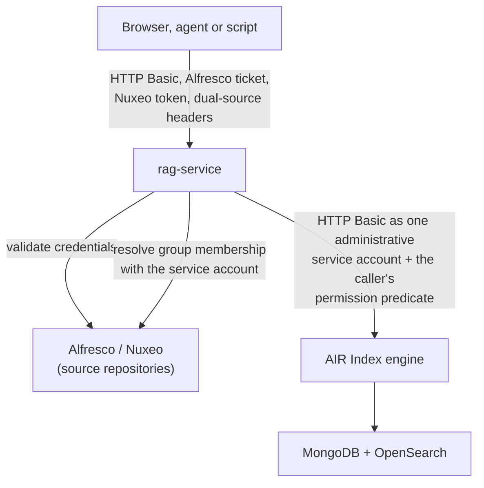

# Security Model

Who is allowed to read what, where that decision is made, and what this design deliberately does not
do.

## The short answer

**`rag-service` is the policy enforcement point for read access. The index is not.**

Every query `rag-service` sends to the index carries a permission predicate that `rag-service` built
from the authenticated caller's identity and group memberships. The index executes that predicate as
part of the query; it does not add one of its own, because the connection is authenticated as a
single administrative service account and an administrative principal is not subject to the engine's
ACL policy.

Two consequences follow, and both are requirements rather than recommendations:

1. **The index port must never be reachable by end users or agents.** A caller who reaches the index
   directly authenticates as themselves against the engine's own user store, or as the service
   account if they hold its credentials, and in the second case no ACL filter applies at all. There
   is nothing in the index that would stop them.
2. **The predicate must exist in exactly one place.** It does: `AclFilterBuilder` in
   `common/content-lake-core/src/main/java/org/hyland/contentlake/security/`. Both the ingest write
   path and every read path go through it, so the two sides of the ACL encoding cannot drift apart,
   and there is a single class to audit and to test.

## The request path

| Hop | Mechanism | Who decides access |
|---|---|---|
| Caller to `rag-service` | HTTP Basic, Alfresco ticket, Nuxeo token, or the dual-source header pair, validated against the configured source repositories | the source repository decides *whether you are you* |
| `rag-service` to the index | HTTP Basic with one service account plus the `HXCS-REPOSITORY` header | nothing; the service account is trusted completely |
| Permission filtering | an HXQL predicate over `sys_racl`, built per request by `AclFilterBuilder` | `rag-service` decides *what you may read* |
| Group resolution | one `SourceGroupResolver` per source type, selected by `SourceGroupResolverRegistry` and called with the service account: Alfresco `GET /people/{user}/groups`, Nuxeo `GET /api/v1/user/{username}` | the source repository is the authority on group membership |
| The engine's own ACL policy | real code, and it runs, but it adds no restriction for an administrative principal | inert for this connection |

Authentication answers a different question from authorization here, and the two live in different
systems: the source repository authenticates, `rag-service` authorizes.

An Alfresco ticket is carried as `Authorization: Basic base64(TICKET_xxx:)`, the ticket as the
username with an empty password. That is the only accepted encoding, in every service, defined once
by `AlfrescoTicketHeader` in `content-lake-core`. The bare `base64(TICKET_xxx)` form is rejected. A
second encoding is worth avoiding because the failure is quiet: a header a service does not recognise
as a ticket falls through to Spring's Basic auth filter, which tries to authenticate the ticket as a
username and returns 401, so the symptom is a feature that stops working rather than a message
naming the cause.

## Adding a credential authority

Authentication and authorization are both extension points, and they are separate because they answer
separate questions. A source needs one of each to support nominal users, and each is useful without
the other:

| Half | Interface | Question | Absent implementation means |
|---|---|---|---|
| Identification | `CallerAuthenticator` | who is this caller? | that source's users cannot sign in, so they hold no identity here |
| Authorization | `SourceGroupResolver` | which groups are they in? | group-granted documents in that source are invisible to their members |

Both live in `common/content-lake-core/.../security/` and both are implemented in
`common/rag-service`. Neither is part of `content-lake-spi` and neither is loaded from a connector
jar. That is deliberate and not a convenience: this code decides who a caller is and what they may
read, inside the service that enforces trimming, so plugin code must not be able to participate.
A connector that ingests ACLs correctly needs no implementation of either to do so; a deployment that
wants those ACLs to be actionable for nominal users needs both.

`MultiSourceAuthenticationProvider` runs the registered authenticators in ascending
`CallerAuthenticator.order()`, with exactly three outcomes:

- **Identities.** The authority recognised the caller. The chain stops, and nothing else is shown the
  credential.
- **A decline** (`null` or an empty result). This authority cannot speak to these credentials, or
  rejected them and that says nothing about the others. The chain continues, and if every authority
  declines the caller is rejected once, at the end. An ordinary password login declines, because a
  password one repository refuses may be valid at another.
- **A thrown `AuthenticationException`.** The credential was addressed to this authority and is
  invalid, so it propagates and no other authority sees it. An Alfresco ticket or a Nuxeo token does
  this, because its marker prefix says unambiguously where it was meant to go.

Two properties of the chain that are security properties rather than details:

- **Order decides which system is shown a caller's credentials first**, so the shipped orders are
  named constants rather than literals, and the resolved chain is pinned by a test. Alfresco is 10 and
  Nuxeo is 20, spaced so an authority can be added without changing where an existing deployment sends
  its passwords.
- **A credential addressed to one authority never reaches another.** A `TICKET_` or `NUXEO_TOKEN::`
  principal is a whole credential presented as a username, so every authenticator that does not own
  that marker declines it without making a call. Forwarding an Alfresco ticket to a third system as a
  username would put it in that system's access log.

An identity may be untyped, and for a single login it always is. An untyped identity answers for every
source type, which is what lets one credential cover a source that has no authenticator of its own.
It also keeps `getName()` the bare username, which matters because that string is a rate-limit bucket
key and the stored author of a feedback row.

## Why the enforcement point is the service

The community index engine offers no delegation primitive. Authentication is HTTP Basic against a
file-backed user store; there is no run-as or on-behalf-of mechanism, and the query API takes no
caller-principals parameter. An integrating service therefore has exactly two options: hold one
credential per end user at the index, or connect with a single service account and inject its own
predicate.

This project does the second. That requires the service account to be an administrator, since a
non-administrative principal would have the engine's own ACL policy applied on top and would see only
what that one account may read, which is not the caller's answer.

## What the model guarantees

- **One implementation.** `AclFilterBuilder` owns the `sys_racl` field name, the `u:` and `g:`
  prefixes, the `_#_<sourceId>` namespacing, the `__Everyone__` mapping, HXQL literal escaping, and
  the fail-closed sentinel. Its callers are `SemanticSearchService`, `HybridSearchService`,
  `RagToolset` (the MCP and agentic tools), `ContentLakeMcpServer`, and `NodeSyncService` on the
  write side. `FacetsService` reuses the filter `HybridSearchService` builds rather than assembling
  its own.
- **No anonymous principal.** `SecurityContextService.getCurrentUsername()` throws when there is no
  authenticated caller. It does not return a placeholder, because a placeholder would resolve to a
  set of authorities and produce a filter, which is a decision made on behalf of nobody. The throw is
  an `AuthenticationException`, so the caller gets 401.
- **An unresolved authorization input is never encoded as a missing filter.** When no permission
  source can be resolved, the predicate is `cin_sourceId = '__unresolved_permission_source__'`, which
  matches nothing. The failure mode is a caller seeing too few documents plus a WARN in the log, never
  too many.
- **A group-directory outage fails closed by default.** `rag.security.group-resolution-failure`
  defaults to `fail-closed`, which drops the unreachable source from the predicate entirely.
  `degrade` is available for deployments that would rather lose group-granted results than a whole
  source: it keeps the caller's own name plus `GROUP_EVERYONE`. Both log at WARN, and an unrecognised
  value reads as `fail-closed`.
- **An identity a directory does not hold is not an outage.** A resolver that reaches its directory and
  finds no such principal returns `null`, and the caller keeps that source with their default
  authorities. Only a resolver that could not ask at all follows the failure policy above. Collapsing
  the two would blank out a source for every site-local principal that legitimately exists in one
  repository and not another.
- **A source type with no resolver expands no groups.** `SourceGroupResolverRegistry` selects by source
  type and ships three, for `alfresco`, `nuxeo` and `sharepoint`; any other type gets the caller's own
  authorities only, so group-granted documents on it are retrievable by nobody rather than by everybody.
  Exactly one resolver may claim a type, and the registry refuses to start otherwise: which of two wins
  would decide who reads what, and bean ordering must not settle that.
- **The `sharepoint` resolver is conditional, and its absence fails closed.** `EntraGroupResolver` exists
  only where `rag.security.entra.enabled` is true, so a SharePoint source on a deployment that has not
  configured it behaves exactly like a source type with no resolver: group-granted documents retrieve for
  nobody. That is deliberate rather than an oversight. A resolver that exists and cannot reach Entra would
  follow the failure policy above and cost callers the whole source, which is worse than losing the group
  grants alone. Site-local `siteUser` and `siteGroup` principals are unresolvable by any resolver, enabled
  or not, and the connector counts them separately at ingest for that reason.
- **Resolved membership is cached, failures are not.** `rag.security.group-cache.ttl-seconds` (300 by
  default) bounds how stale a caller's membership may be, keyed by source type and username so no
  entry is shared between callers. A directory failure is never cached, so an outage is retried on the
  next query instead of held for the TTL.
- **Reading a whole source is opt-in.** A member of `GROUP_ALFRESCO_ADMINISTRATORS` can be granted an
  Alfresco source with no `sys_racl` condition at all, which is the widest grant the filter can
  express. `rag.security.admin-bypass.enabled` therefore defaults to `false`, so an administrator is
  ACL-filtered like every other caller unless a deployment says otherwise. The bypass never applies
  to a Nuxeo source, whatever the flag says.
- **Group principals never merge across sources.** `g:sales_#_alfresco` is not `g:sales_#_nuxeo`. Two
  repositories can each have a `sales` group with different members, so stripping the suffix would
  hand each population the other's documents. A test fails if anyone strips it.
- **Every filter chain denies by default.** Across all runnable modules the only public paths are
  `/actuator/health` and `/actuator/info`, plus `/api/rag/health` on `rag-service`. Everything else,
  including unmapped paths and `/actuator/metrics`, returns 401. Adding a route takes no security
  configuration to protect it. Each chain carries a negative test asserting exactly that.
- **Tool and agent identity comes from the request, never from an argument.** MCP tools and the
  agentic retrieval tools read the principal from the `SecurityContext` of the authenticated request,
  so an agent cannot ask to be someone else. `RagSecurityConfig` records this as an in-code
  invariant next to the one keeping `/mcp` authenticated.
- **Cached results never cross principals.** When `rag.cache.enabled` is on, retrieval-result cache
  entries are keyed by the authenticated principal. The TTL, 60 seconds by default, bounds how stale
  a caller's group membership may be.
- **Feedback is readable by its submitter.** A feedback entry holds a user's question and the answer
  they were given. `GET /api/rag/feedback` adds a predicate on the stored submitter to every query;
  the aggregate view the evaluation harness needs is `?scope=all`, restricted to the accounts in
  `rag.feedback.operator-users`, which is empty by default.

## What the model does not do

Stated plainly, because each of these is a reasonable thing to assume and none of them is true.

- **No enforcement at all if a caller reaches the index directly.** The predicate is applied by the
  client. Bypassing the client bypasses the predicate. This is the single most important property to
  understand about this design.
- **No per-user credentials at the index.** One service account serves every caller. The index's
  audit trail therefore shows the service account, not the end user; correlating a query to a user
  means reading the `rag-service` log, or the trace backend when span payloads are on. Spans identify
  a conversation by a truncated hash of the session id rather than the username, so a trace backend
  never receives a login name, but the log still holds the query text it always did.
- **Trace payloads are not ACL-filtered.** With `rag.observability.capture-content` on, a span carries
  the caller's question, the text of the chunks retrieved for it, those documents' names and paths, and
  the generated answer. Whoever can read the trace backend can read all of it, and that set of people
  is not the ACL that governed the retrieval. This is why content capture is a separate switch from
  `rag.observability.payloads-enabled` rather than a verbosity level of it: ids, scores and counts are
  opaque and travel by default, content does not travel at all unless someone decides it should. Source
  paths are treated as content for the same reason chunk text is, because a path like
  `/HR/Terminations/2026/jsmith-severance.pdf` discloses more than most chunk bodies. Both switches
  default to off, and turning the first on does not turn the second on.
- **No group expansion for a CMIS source, so its group-granted documents are invisible to their
  members.** CMIS has no `memberOf` operation in the specification, and the connector's ACL mapper reads
  raw principal ids, so it cannot tell a user from a group; the only group-shaped principal it
  recognises is the repository's "anyone", mapped to `GROUP_EVERYONE`. A CMIS caller can sign in and is
  trimmed to their own name plus `__Everyone__`, which means public documents and documents granted to
  them by name are retrievable and documents granted only to a group they belong to are not. This is
  fail-closed, so nothing leaks, but results are **incomplete and nothing in the answer says why**: to a
  user it reads as a document that is not in the index. No resolver is written for the type deliberately,
  because a resolver that exists and cannot work is worse than none: `group-resolution-failure` could
  then cost a caller the whole source rather than only its group grants.
- **No federation and no SSO across repositories.** Principals stay source-native and namespaced per
  source instance, and nothing maps one repository's identity onto another's. A caller may hold a
  separate identity per source and be trimmed to each one independently, but each of those identities
  has to be established by a credential that source accepts. Where a caller has no identity for a
  source, the fallback identity is used as-is, which assumes the same login string is valid there;
  that assumption is the reason a source whose usernames differ needs its own authenticator rather
  than the fallback.
- **No write authorization.** `rag-service` is read-only. Ingestion runs with the ingesters' service
  accounts, and what lands in the index is decided by scope configuration, not by an end user's
  permissions.
- **No revocation latency guarantee.** ACLs in the index are a copy of the source ACLs at ingest
  time, reconciled by the live path and by `POST /api/sync/permissions`. Between a permission change
  in the source and its reconciliation, the index is stale. Group membership, by contrast, is read
  live per request (subject to the cache TTL above).
- **Deny ACEs are not evaluated at query time.** The predicate is a grant match over `sys_acl`, which
  is built from read authorities only. Alfresco supplies effective read authorities, so its deny rules
  are already resolved upstream; Nuxeo can supply explicit deny principals, and those are stored as
  `cin_deny` for completeness but take no part in the predicate. A model that needs
  deny-overrides-grant semantics evaluated at query time does not get them here.
- **No OAuth2, OIDC, JWT or API keys.** Bearer-token authentication is not supported at either hop.

## Rejected alternatives

**A caller-supplied principals list on the query API.** Letting the client pass the principals to
filter by would move the authorization decision into the request payload. Any party able to reach the
index could then name any principal, which is the confused-deputy pattern the MCP threat model
describes, and it would bypass server-side group expansion, since the caller would be asserting group
membership rather than the repository resolving it. The current design has the same weakness against a
caller who reaches the index directly, which is exactly why that reachability is a deployment
requirement rather than a recommendation; adding the parameter would make it reachable through the
supported API as well.

**Per-user entries in the engine's user store.** The community distribution's user store is a file
with plaintext (`{noop}`) passwords, no provisioning API and no group synchronization. Mirroring
repository users into it means duplicating credentials into a second store, keeping them in sync by
hand, and reimplementing group expansion, and it would still not express Alfresco or Nuxeo ACL
semantics.

**Enforcement in the index via a run-as primitive.** This is the right long-term answer and it is
tracked as a roadmap item on the engine, not built here: a guarded, default-off, allow-listed run-as
header for trusted services, rejecting administrative targets and audited on every use. It needs
engine changes, which are out of scope for this project.

## Deployment hardening checklist

The deployment stack in `content-lake-app-deployment` is a local development stack. Its committed
credentials are world-readable by design, which makes it safe to run on a laptop and unsafe to expose.
Before any deployment reachable by someone else:

- [ ] **Do not publish the index port.** The engine should be reachable only from the services that
      need it, on an internal network. In the compose stack the `hxpr-app` service publishes no port
      and is reachable only inside the compose network; keep it that way, and do not add a reverse
      proxy route to it.
- [ ] **Change every default credential.** The engine service account, the Alfresco and Nuxeo
      accounts, the database and broker passwords, and the search backend's admin password. The
      deployment repository's README lists the committed defaults and which of them matter most.
- [ ] **Hash the passwords in the engine's user store.** Replace `{noop}` plaintext with a bcrypt
      encoding, and use a non-default password for the service account. That account is an
      administrator on the index by design, so it is the single highest-value credential in the
      system.
- [ ] **Leave the search backend's own security enabled.** The development stack sets
      `plugins.security.disabled=true` on OpenSearch and runs the dashboards without authentication.
      Both are development conveniences and neither belongs outside a laptop.
- [ ] **Pin CORS if you enable it.** No service enables CORS today, so a browser cannot call
      `rag-service` cross-origin. If a deployment adds a CORS configuration, name the allowed origins
      explicitly; never combine a wildcard origin with credentialed requests.
- [ ] **Terminate TLS in front of the services.** All hops use HTTP Basic, so every credential is a
      replayable secret in a header. Basic over plaintext HTTP on a shared network hands out both the
      caller's repository password and, on the internal hop, the index service account.
- [ ] **Keep the ingester sync endpoints closed.** They trigger full re-ingests.
      `plugin-batch-ingester` requires an explicit username and password and refuses to start
      without them, precisely because it has no source repository to authenticate against.
- [ ] **Review `rag.security.admin-bypass.enabled`.** It defaults to `false`. The development stack
      opts in, because `admin` is its working account. A deployment where administrators must not see
      documents their own ACLs exclude leaves it off.
- [ ] **Review `rag.feedback.operator-users`.** Empty by default. Anyone listed can read every user's
      questions and generated answers.
- [ ] **Keep `rag.security.group-resolution-failure` at `fail-closed`** unless losing group-granted
      results is worse for you than losing a whole source, and watch for the WARN either way.
- [ ] **Set `rag.security.group-cache.ttl-seconds` to what your revocation window allows.** 300 by
      default. A revoked group membership stays effective for up to that long; `0` disables the cache
      and asks the directory on every query.
- [ ] **Decide `rag.security.entra.enabled` before ingesting a SharePoint source.** Off by default, and
      while it is off every group-granted SharePoint document is retrievable by nobody. Turning it on is
      what makes those ACLs actionable; leaving it off is a defensible choice, but it should be a choice
      rather than a discovery after a crawl.
- [ ] **Do not expose `/actuator/metrics` or `/actuator/prometheus` publicly.** They require
      authentication already; a scraper needs an account valid in one of the configured sources.
- [ ] **Leave `rag.observability.capture-content` at `false`** unless the trace backend sits inside the
      same trust boundary as the index. It copies questions, chunk text and document paths out of the
      service, and the backend applies its own access model rather than the documents' ACLs. The
      `observability` compose profile bundles an anonymous-admin Grafana and is for development only.
- [ ] **Point `management.otlp.tracing.endpoint` at a collector you control.** Blank, the default,
      exports nothing. A collector is an egress path for whatever the spans carry.

## Where to look in the code

| Concern | Location |
|---|---|
| The permission predicate, both directions of the ACL encoding, HXQL escaping | `common/content-lake-core/.../security/AclFilterBuilder.java` |
| Caller identity, and the refusal to invent one | `common/content-lake-core/.../security/SecurityContextService.java` |
| Filter chain, public paths, MCP invariants | `common/rag-service/.../config/RagSecurityConfig.java` |
| The authenticator contract, and what each of its three outcomes means | `common/content-lake-core/.../security/CallerAuthenticator.java` |
| The chain, its order, and the one rejection at the end | `common/rag-service/.../security/MultiSourceAuthenticationProvider.java` |
| Credential validation against the source repositories | `common/rag-service/.../security/AlfrescoDirectory.java`, `NuxeoDirectory.java` |
| Which principal forms are a credential rather than a username | `common/rag-service/.../security/ReservedPrincipals.java` |
| A caller's identities, and the single untyped case | `common/content-lake-core/.../security/CallerIdentities.java`, `CallerIdentityService.java` |
| Predicate construction per query | `common/rag-service/.../service/SemanticSearchService.java`, `HybridSearchService.java` |
| The resolver contract, and what each of its three answers means | `common/content-lake-core/.../security/SourceGroupResolver.java` |
| Resolver selection, the failure policy, the membership cache | `common/rag-service/.../security/SourceGroupResolverRegistry.java` |
| Which source ids exist and what type each is | `common/rag-service/.../service/PermissionSourceCatalog.java` |
| ACEs written at ingest | `common/content-lake-core/.../service/NodeSyncService.java` |
| Feedback authorization | `common/rag-service/.../service/FeedbackService.java` |
| Span payload gating and content redaction | `common/rag-service/.../observability/RagObservations.java` |
| The two observability switches and their defaults | `common/rag-service/.../config/RagProperties.java` (`ObservabilityProperties`) |

Related documentation: [architecture.md](architecture.md) for the ACL data model and the design
decisions behind it, and the deployment repository's RAG deployment guide for the environment
variables named above.
